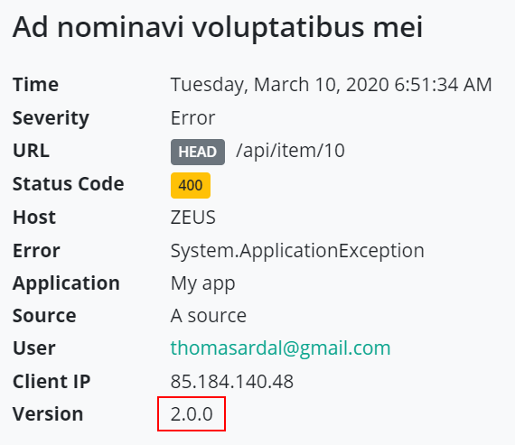
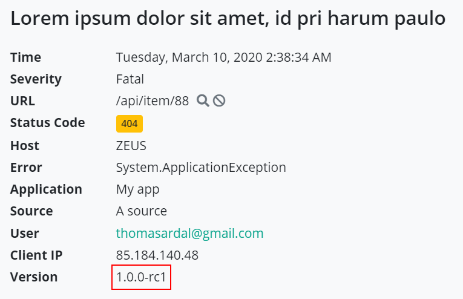
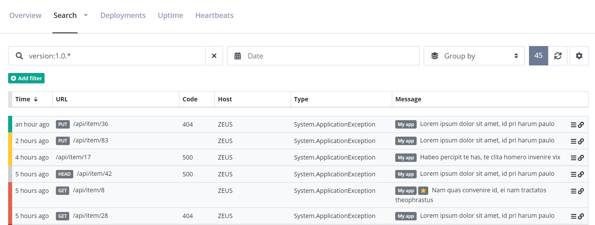

# Adding Version Information
Almost every piece of software has some sort of version. Whether it's a nice looking [SemVer](http://semver.org/) string or a simple timestamp, being able to distinguish one version from the other is important. elmah.io supports sending version information from your application in every message logged in two ways:

1. By adding the version manually (as explained in this document).
2. By using the [Deployment Tracking](https://elmah.io/features/deploymenttracking/) feature (as explained in [Set Up Deployment Tracking](setup-deployment-tracking.md)).

## Version Numbers on the UI
Let's start by looking at how version numbers are represented in the elmah.io UI. Every message contains a version property as illustrated below:



The error is logged by an application with version number 1.0.0. Looking at another error, the version number may look different:



This way, you will be able to see which version of your software that logged each message.

Having the version number on the message, opens up some interesting search possibilities. Imagine that you want to search for every message logged by 1.0.* versions of your software, including release candidates, etc. Simply do a search in the search box like this:



The example above finds every message logged from 1.0.0, 1.0.0-rc1, 1.0.1, etc.

## Adding Version Numbers
How you choose to represent version numbers in your system is really up to you. elmah.io doesn't require SemVer, even though we strongly recommend you to use it. Version is a simple string in our [API](https://elmah.io/api), which means that you can send anything from SemVer to a stringified timestamp.

Adding a version number to every message logged in elmah.io, is easy as 1-2-3. If you're using our API, there's a property named `version` where you can put the version of your application. Chances are that you are using one of the integrations like ELMAH, log4net or Serilog. In fact, there's multiple ways to send a version number to elmah.io.

### Globally using ELMAH

You probably want to attach the same version number on every message logged in elmah.io. The easiest way to achieve that, is to create a global event handler for the OnMessage event, which is triggered every time the elmah.io client logs a message to elmah.io:

```csharp
Elmah.ErrorLog.GetDefault(null); // Forces creation of logger client
var logger = ErrorLog.Client;
logger.OnMessage += (sender, args) =>
{
    args.Message.Version = "1.2.3"; // Requires elmah.io.core version >= 2.0.26
}
```

In the example, the message send off to elmah.io is decorated with the version number `1.2.3` You will need to replace this with the value of an app setting, the assembly info or whatever strategy you've used to make the version number available to your code.

### Try/catch using ELMAH

If you're logging errors to elmah.io in catch blocks, logging the version number can be done using a similar approach to the above:

```csharp
try
{
    CallSomeBusinessLogic(inputValue);
}
catch (Exception e)
{
    e.Data.Add("X-ELMAHIO-VERSION", "1.2.3");
    ErrorSignal.FromCurrentContext().Raise(e);
}
```

In this case, the code at this point doesn't know anything about elmah.io. Luckily, there's an alternative to the Version property, by putting a custom element in the Data dictionary on Exception. The exact name of the key must be `X-ELMAHIO-VERSION` for elmah.io to interpret this as the version number.

### Using log4net

log4net supports the concept of customer properties in various ways. Since log4net properties are converted to custom properties in elmah.io, the easiest way to add a version number of every message logged through log4net, is by configuring a global property somewhere in your initialization code:

```csharp
log4net.GlobalContext.Properties["X-ELMAHIO-VERSION"] = "1.2.3";
```

The property name is equal to the custom element we used in the last section.

log4net supports custom properties in the context of a log call as well. To do that, put the `X-ELMAHIO-VERSION` property in the `ThreadContext` before logging to log4net:

```csharp
log4net.ThreadContext.Properties["X-ELMAHIO-VERSION"] = "1.2.3";
log4net.Error("This is an error message");
```

### Using NLog

The elmah.io NLog target can use the `OnMessage` action:

```csharp
var elmahIoTarget = new ElmahIoTarget();
// ...
elmahIoTarget.OnMessage = msg =>
{
    msg.Version = "1.2.3";
};
```

### Using Serilog

Serilog can decorate all log messages using enrichers:

```csharp
var logger =
    new LoggerConfiguration()
        .Enrich.WithProperty("version", "1.2.3")
        .Enrich.FromLogContext()
        .WriteTo.ElmahIo(new ElmahIoSinkOptions("API_KEY", new Guid("LOG_ID")))
        .CreateLogger();
```
