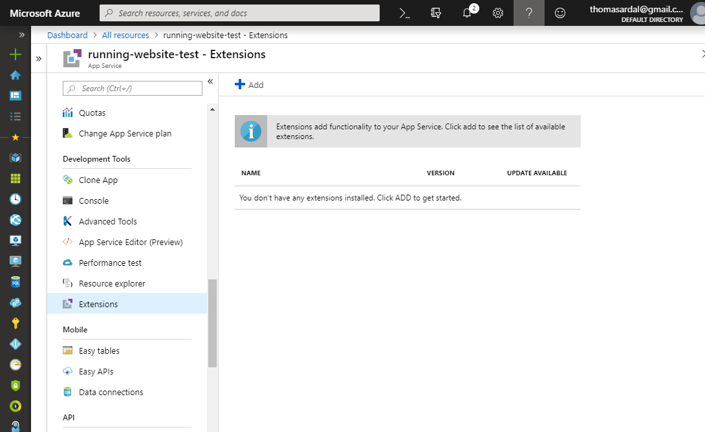
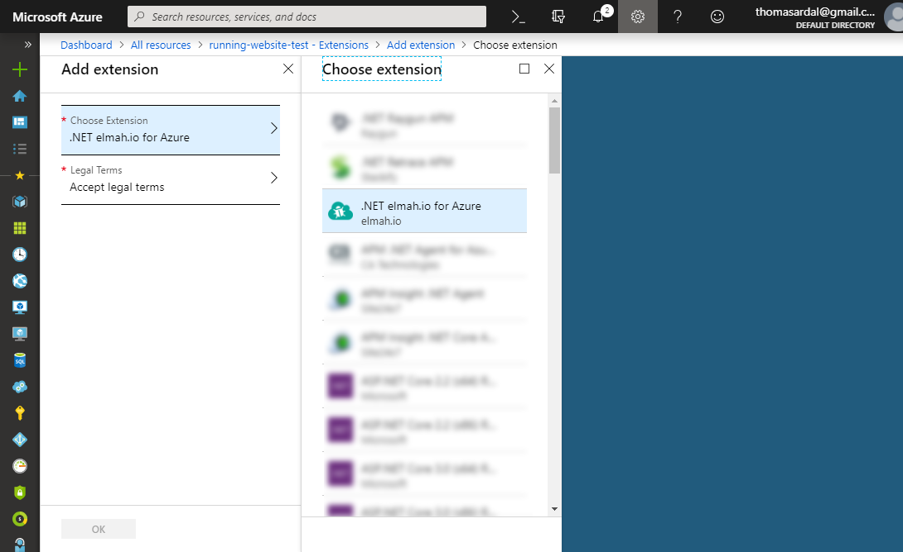
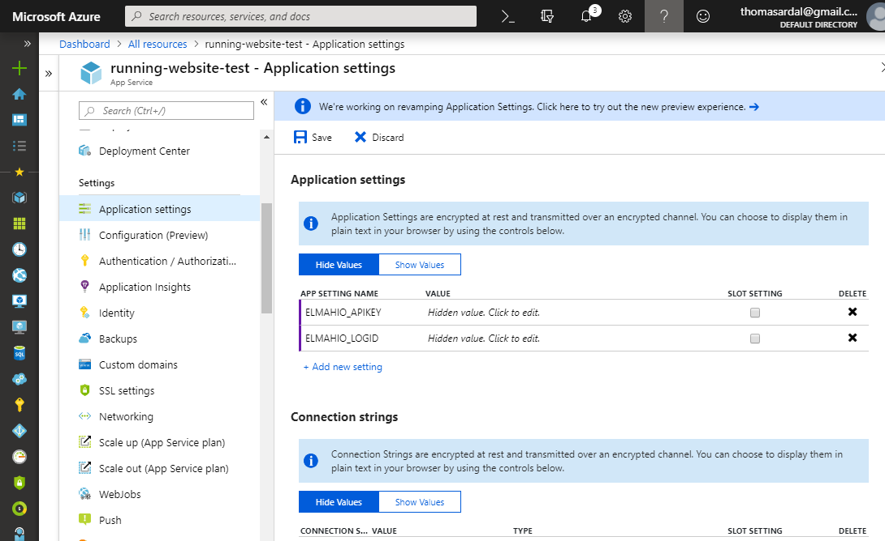

# Logging to elmah.io from a running website on Azure

To enable error logging to elmah.io, you usually install one of our client integrations through PowerShell or Visual Studio and deploy a new version of your website to a web server. Sometimes you need to monitor an already running website or don't want logging logic as part of your repository. Using the elmah.io Site Extension for Azure App Services, error logging can be added to an already running website.

Check out this video tutorial or keep reading for the text version:

  <iframe class="embed-responsive-item" src="https://www.youtube.com/embed/R50FCpRtkjc?rel=0" allowfullscreen></iframe>

 

To start logging errors from your Azure web application, go to the Azure Portal and select the website you want to monitor. Click the *Extensions* tool:

Click the *Add* button and select **.NET elmah.io for Azure**:

Accept the terms and click the *OK* button. The elmah.io Site Extension is now added. Once added, restart the website for the new extension to load.

Finally, you need to add your API key ([Where is my API key?](https://docs.elmah.io/where-is-my-api-key/)) and log ID ([Where is my log ID?](https://docs.elmah.io/where-is-my-log-id/)) to *Application settings*:

Make sure to use the app setting names `ELMAHIO_APIKEY` and `ELMAHIO_LOGID`.

Your Azure web application now logs all uncaught exceptions to elmah.io. Please notice that this only works for ASP.NET, MVC, Web API, and similar. ASP.NET Core websites should be installed locally and re-deployed. Also, the elmah.io Site Extensions supports .NET Full Framework 4.6 and newer.