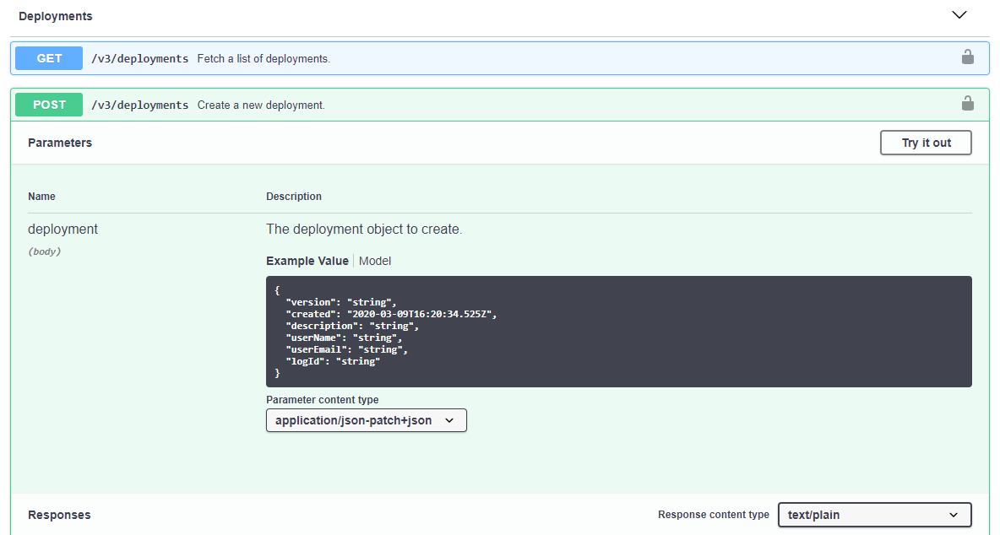

# Set Up Deployment Tracking

Deployment tracking creates an overview of the different versions of your software and show you how well each version performed. With this integration in place, you will be able to see when you released and if some of your releases caused more errors than others. While most pages on elmah.io supports everything from verbose to fatal messages, the context on deployment tracking is around warnings and errors.

To set up deployment tracking, you will need two things:

1. Decorate all of your messages with a version number.
2. Tell elmah.io when you release using our REST API or one of the integrations.

When set up, deployment tracking is available on each of your logs.

## Decorate your messages with a version number

Check out [Adding Version Information](http://docs.elmah.io/adding-version-information/) for details.

## Tell elmah.io when you release

When you create a release of your software either manually or with the help from a tool like Octopus, you need to tell elmah.io about it. The [elmah.io REST API v3](https://api.elmah.io/swagger/ui/index), provides an endpoint named `deployments`, which you can call when creating releases.

### Manually using Swagger UI

If you release your software manually, creating the new release manually is easy using Swagger UI. Swagger UI is a graphical client for calling a Swagger enabled endpoint (much like Postman). Navigate to [https://api.elmah.io/swagger/ui/index](https://api.elmah.io/swagger/ui/index), expand the _Deployments_ node and click the POST request:



To create the release, input your API key (found on your profile) in the top right cornor and click the JSON beneath _Model Schema_. This copies the example JSON to the deployment parameter. A minimal deployment would look like the following, but adding more information makes the experience within elmah.io even better:

```json
{
  "version": "1.42.7"
}
```

The version string in the example conforms to SemVer, but the content can be anything. The date of the release is automatically added if not specified in the JSON body.

Click the _Try it out!_ button and the deployment is created.

### Using PowerShell

If you release your software using a build or deployment server, creating the new release is easy using a bit of PowerShell. To request the `deployments` endpoint, write the following PowerShell script:

```powershell
$version = "1.42.7"
$ProgressPreference = "SilentlyContinue"
$url = 'https://api.elmah.io/v3/deployments?api_key=API_KEY'
$body = @{
  version = $version
}
Invoke-RestMethod -Method Post -Uri $url -Body $body
```

(replace `API_KEY` with your API key found on your profile)

In the example, a simple version string is sent to the API and elmah.io will automatically put a timestamp on that. Overriding user information and description, makes the experience withing the elmah.io UI better. Pulling release notes and the name and email of the deployer, is usually available through environment variables or similar, depending on the technology used for creating the deployment.

### Using Octopus Deploy

In progress.

### Using Visual Studio Team Services

In progress.