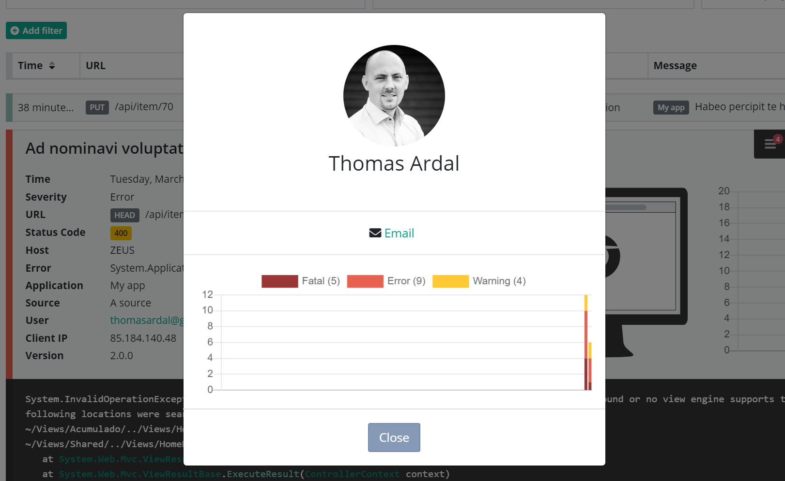

# Use Extended User Details
## without Email as Id

As you may know, ELMAH automatically logs the user identity as part of the error. To make that happen, ELMAH uses the identity object on the current thread, which gets set by most authentication frameworks for .NET (like ASP.NET Membership Provider and ASP.NET Identity). Some of you may use the user's email as key, while others use something like a database identifier. If you are using an email, you are already covered and able to see Extended User Details. If not, you need to provide elmah.io with a little help.

In order to tell elmah.io about the user's email and still keeping the identifier in the user field, you can enrich the message with a piece of custom data, before sending it off to elmah.io. In order to fully understand the code below, you need to know a bit about `ILogger`. `ILogger` is part of the raw [elmah.io client](http://www.nuget.org/packages/elmah.io.client), able to communicate with the [elmah.io API](https://elmah.io/api). `ILogger` isn’t dependent of ELMAH and it pretty much corresponds to other logging clients known from log4net, NLog, etc.

```csharp
Elmah.ErrorLog.GetDefault(null); // Forces creation of logger client
var logger = ErrorLog.Client;
logger.OnMessage += (sender, args) =>
{
    if (string.IsNullOrWhiteSpace(args.Message.User)) return;
    var db = ...;
    var user = db.GetById<User>(args.Message.User);
    args.Message.Data.Add(new Item {Key = "X-ELMAHIO-USEREMAIL", Value = user.Email});
}
```

The first line forces creation of the client. The elmah.io `ErrorLog` implementation uses a singleton `ILogger` to communicate with elmah.io.

We then register a new event handler on the `OnMessage` event. `OnMessage` event handlers are executed just before a message is send to elmah.io. In the body of the event handler, the user's email is fetched from the database by calling the `GetById` method. How you will be able to convert the user ID to an email depends on your tech stack, but you get the picture.

In the last line the data collection of the message is enriched with a new key value pair. `X-ELMAHIO-USEREMAIL` tells elmah.io, that the value of that item contains the email of the user involved in the currently logged message.

That’s it! 9 lines of code and you are able to watch every little details about the users experiencing problems on your website:


